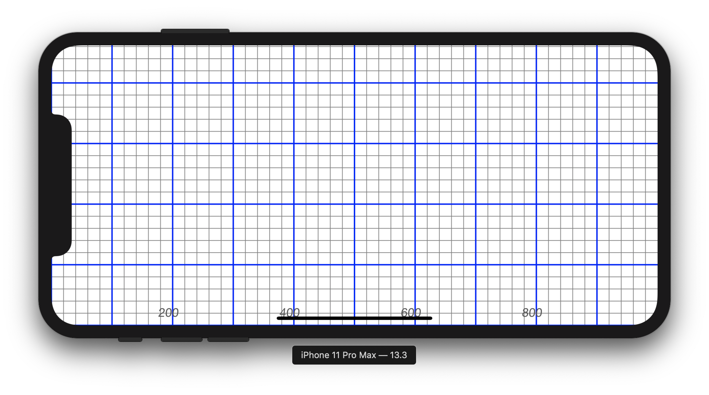
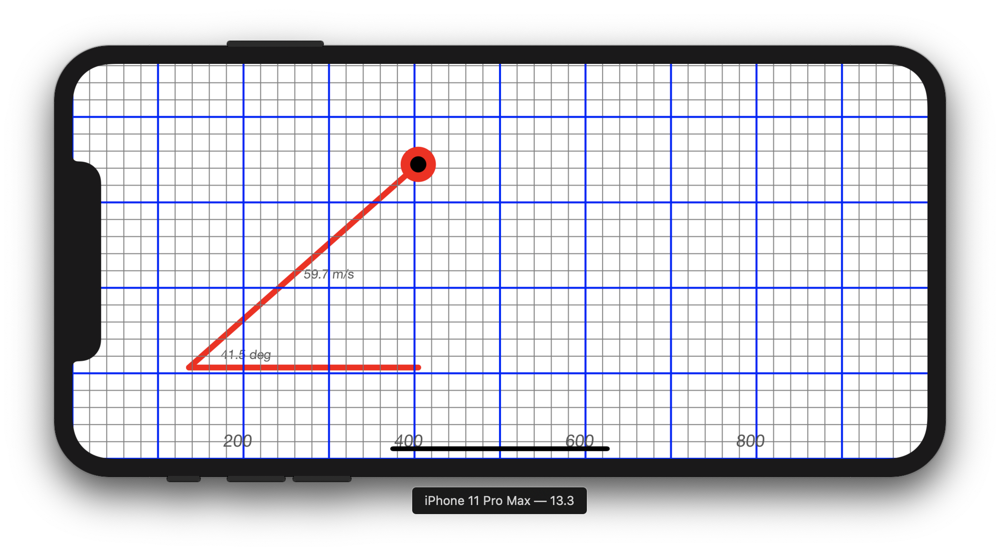
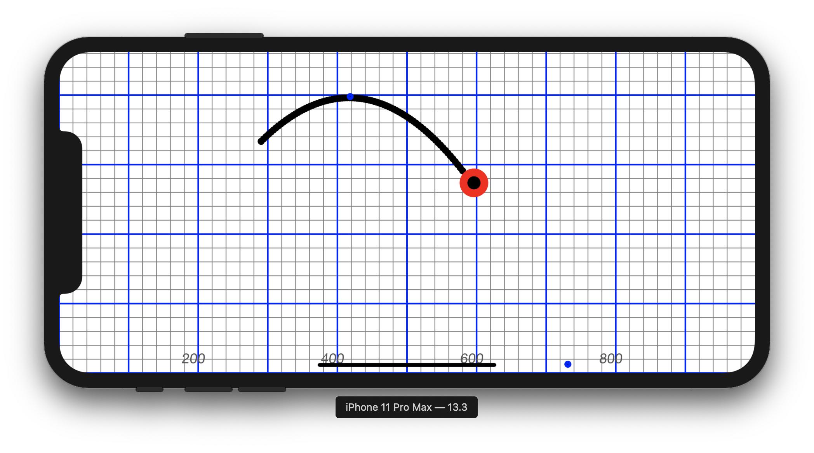

## Author: 
### Name: Farhoud Talebi
    
## Purpose:
    To show a graphic simulation of how a projectile shot at a given velocity and angle will travel based on Euler's equations of motions and also the theoretical equations. Results are in accurate real world numbers, ie. a high school student can use this as a tool to check their physics calculations.
    
## Compilation and execution instructions:
    • Open Xcode project with Xcode
    • Select iPhone SE (reccomended) as device to launch on
    • Press the "play" button or Build and Run via the xCode commands.
    • For ideal execution run in horizontal mode and only launch from left to right (ie. Drag to the left and down)

